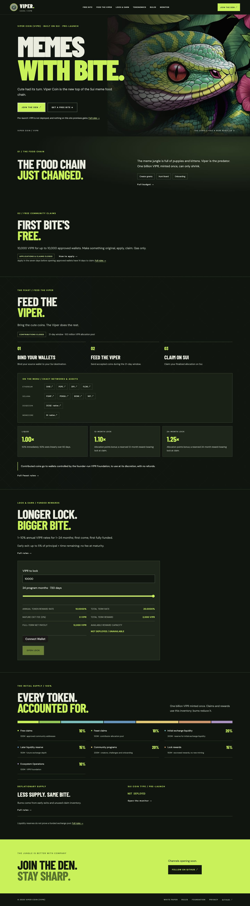
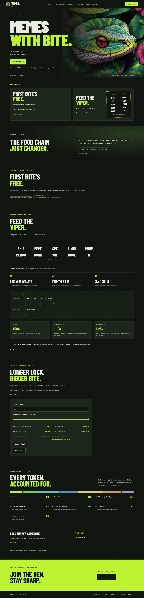
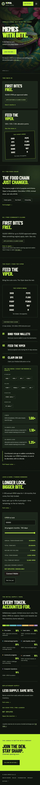

# Overnight implementation report

## Task 1: security iteration

Blocked: the referenced `vipercoin-codex-iteration-3.md` is unavailable. The project, Downloads, named attachments and exact filename index search contained no copy. There is no uncommitted security work, and the local and remote security branch both point to `865b782e0b537ee06df79155d602a35df6ca04c3`. No security fixes or new auditor tag are claimed. The existing auditor tag is unchanged.

## Task 2: branch synchronization

The website branch already contains the entire security-branch head. A normal, non-rebased merge was attempted; Git reported that it was already up to date. No synthetic merge commit or invented security change was created. This checkpoint records the missing prerequisite and preserves the exact current-homepage screenshots as before evidence.

## Decisions I made

- Missing security instructions block Task 1 and its new auditor tag. Continue with the independent tasks, as directed.
- An already-contained branch needs no artificial merge. Preserve its existing ancestry.
- Existing localnet test keys may be generated only in memory; no production keys, IDs or deployments will be added.

## Before screenshots

The baseline is the unchanged website branch head `cd374893c32ec6657e1feb7bf68ebf5f8bbedb3e`. These are its previously verified full-page captures, reused without image editing.

Task 2 validation: Move tests; all npm test scripts (economics, monitor, whitepaper, Feast, claims, rehearsal, Pyth, site); typecheck; lint; Pages build; deployment checks passed. The localnet rehearsal completed its 13 transactions with the two expected time-gated rejections. No deployment was performed.

## Task 3: V1PER identity

Renamed the coin, currency symbol, one-time witness and module to V1PER / `viper::v1per`, with the source file `v1per.move`. Updated the frontend validation, BCS references, signatures, tools, metadata and prose. Regenerated 852 economic vectors and the independently verified DOGE signed-message fixture using a transient test key kept only in memory. Added a shared React wordmark and LaTeX macro; the social PNG is regenerated from its SVG. CI rejects superseded names outside the single changelog record.

The white paper remains in its existing editor and compiled successfully with the native compiler. White pages use dark letters and the magenta digit to preserve readability. The localnet scratch directory now stays inside the project; no existing deployment IDs or protocol amounts were changed.

Task 3 validation: the full suite passed, including 80 Move tests and the localnet rehearsal with the explicit currency-identity assertions. Auditor references retain the actual immutable security commit, rather than implying the old tag was renamed. All frontend checks and the Pages build were repeated after the final presentation edits.

## Task 4: supply wording

The canonical description is “Deflationary supply: minted once, burn-only,” including the white paper identity table, website overview, README and PDF metadata. Regenerated the same LaTeX source. Added `test:supply` across tracked sources and built files, also run by deployment checks after building. CI now extracts the actual typeset PDF with pinned pypdf, checking its supply label and metadata before provenance or publication artifacts are accepted.

Task 4 validation: native LaTeX compilation and the complete pre-push suite passed, including the new source/built-site supply guard. The extracted-PDF check runs on the CI-typeset artifact; its result is recorded after CI completes. Also corrected the chart accessible-label and unit rendering from the rename pass.

Task 4 CI result: [run 37214614117](https://github.com/Robertcurzon/ViperCoin/actions/runs/37214614117) passed every verification job; deployment was skipped. Downloaded its seven-page PDF, verified both SHA-256 provenance hashes against the current source, and independently repeated the extracted-text/metadata test locally. PDF SHA-256: `97789de0e2084895c61b5377afbc3a121e67bcb30db2d285a955e38278d433ef`. The refreshed PDF is available to the local viewer; it is an ignored CI artifact, not a hand-edited export.

## Task 5: homepage order and readability

The homepage has the requested eight sections: two-line hero, Two ways in, story, free claims, Feast, Lock & Earn, tokenomics, Join the Den. The preview cards stack on mobile, link to their full sections, show the approved-wallet amount/status and allocation multipliers, and keep all three disclosures visible. Closing-band text is near-black. Disabled actions use a solid dark surface and bone-white text; the unavailable lock/claim action says “Not live yet.”

Added `test:contrast` to CI with pinned Playwright/Chromium and a raster-background contrast calculation. It checks every rendered text run, including open Rules details and wallet shadow-root text, at 1440px and 390px on all four routes. It separately hovers every visible interactive control, checks the keyboard skip link, the mobile menu and the community dialog, and requires the digit to differ from its surrounding letters. Text is temporarily hidden only inside the isolated test browser when capturing its background; no site or evidence image is edited. Thresholds follow [WCAG AA contrast](https://www.w3.org/WAI/WCAG22/Understanding/contrast-minimum.html): 4.5:1 for body text, 3:1 for large text. This is a focused contrast test, not a claim of complete accessibility certification.

Task 5 contrast result: all eight route/viewport combinations passed, covering 2,152 default rendered text runs and 197 hovered controls, plus the dialog and mobile navigation. PDF/brand palette combinations also pass the body threshold. The checker resolves modern CSS colors through canvas and scopes a modal check to its active content; inactive underlay is checked separately in the default state. Hover digit colors and overly broad nested-span styles were corrected.

Task 5 validation: the entire pre-push suite passed, including Move, every npm test script, typecheck, lint, the Pages build, deployment checks and contrast. [Contrast matrix](overnight-review/contrast-task5.json).

## Task 6: optional Feast menu art

Added one reusable FeastMenu component for the Feast section and the Two ways in thumbnail. It displays the ten accepted tickers grouped by source network until a valid owner-supplied `public/feast-menu.webp` loads. An absent or unreadable image stays hidden; the text board remains. Descriptive alt text lists every menu coin. The social kit has a matching fourth card with the same image/fallback behavior. Item 5 of ART_BRIEF.md contains the owner's prompt verbatim. No illustration, logo or official mascot was generated or added.

Added `test:menu` for exact accepted-coin parity, both board sizes, alt text, the project-base image URL, social support and the brief. Browser coverage additionally verifies successful image decoding with an existing project asset used only as an intercepted fixture, then a 404 fallback; the fixture is never written to the owner-art path.

Task 6 browser result: the valid-image and missing-image paths passed at both widths. The final contrast matrix covers 2,216 default text runs and 197 hovered controls, plus dialog/navigation states. [Final matrix](overnight-review/contrast-final.json).

## Branch checkpoints and tags

- Security branch `codex/v2-economics-feast`: `865b782e0b537ee06df79155d602a35df6ca04c3`, unchanged. Task 1 is blocked; no new auditor tag was created and the existing tag was not moved.
- Task 2 website checkpoint: `318761321f780cb040ef17300fb0e8b4fda76fb8`.
- Task 3 identity checkpoint: `fee56cbbbfa041b8b167f3b1f186168b1d3f7094`. [CI passed](https://github.com/Robertcurzon/ViperCoin/actions/runs/37213910482).
- Task 4 supply checkpoint: `06423e21c3b4fe7ab5b687957f35e409aef56186`. [CI passed](https://github.com/Robertcurzon/ViperCoin/actions/runs/37214614117).
- Task 5 homepage checkpoint: `ff68a90377606709323554c2952beddfbb59df4a`. [CI passed](https://github.com/Robertcurzon/ViperCoin/actions/runs/37217443374).
- Task 6 is the final commit containing this report on `codex/website-brand`; its exact head is reported in the conversation after pushing.
- No main merge, main push, force-push, deployment, production key or production ID was added.

## Additional decisions I made

- Retain the current protocol allocations, rates, fees and launch gates. A branding brief does not authorize inventing the missing security iteration.
- Retain the same open LaTeX filename and editor. Use the native compiler for source validation and the existing CI typesetter for the downloadable PDF.
- On a white paper page, use dark letters with a magenta digit; pale lime or bone-white would be unsuitable against white.
- Keep the current hero/logo references because the owner specifically reserves illustration generation. Document their existing replacement/rights status.
- A missing or undecodable menu file falls back to tickers; no substitute logo, mascot, generated art or invented live state is used. Rebuild after adding the owner-supplied public asset.
- Run localnet with ephemeral in-memory test wallets and scratch data under the project. The independent DOGE signature fixture contains public test data only.
- Native browser PDF content is not DOM text; its white-page palette is checked separately, while the four-route contrast matrix covers the website and viewer controls.

## Final screenshots

These are unedited full-page browser captures from the final Pages build, with the owner-art slot using its real missing-file fallback. The original baseline captures above are unchanged.

## Continuing launch prerequisites

The site remains pre-launch with blank production deployment records. Authenticated Pyth historical readiness is still unavailable; synthetic Pyth tests are not evidence of a live archive. The missing iteration-3 security brief still needs to be supplied before its fixes and a new auditor release can be completed. Owner-generated menu art is optional and intentionally absent.

Task 6 validation: the final full pre-push suite passed: 80 Move tests; every npm test script (`test:economics`, `test:monitor`, `test:whitepaper`, `test:feast`, `test:claims`, `test:rehearsal`, `test:pyth`, `test:site`, `test:brand`, `test:supply`, `test:contrast`, `test:menu` and the post-build `test:deployment`); typecheck; lint; and the `/ViperCoin/` Pages build. The localnet rehearsal again verified `::v1per::V1PER`, symbol V1PER and name V1PER Coin, with 13 transactions and the two expected time-gated rejections. Native LaTeX compilation and CI PDF text/provenance checks were completed in Task 4.
