
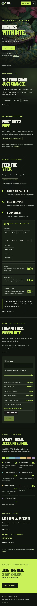
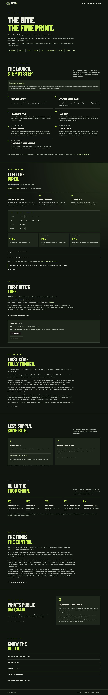



# V1PER Coin (V1PER): website and brand review

Branch: `codex/website-brand`, based on `codex/v2-economics-feast`. The five brief steps are committed separately. Main has not been changed or deployed.

## Result

The homepage now has seven blocks: Hero, Story, Free claims, Feast, Lock & Earn, Tokenomics with burns and proof, and Join the Den. Full participation, Foundation custody, liquidity, privacy, timeline and FAQ details live at `/rules/` with matching homepage anchors. The free-claim application and guarded claim action are there; they are no longer inside the locking section.

The primary action opens a native community dialog. X, Telegram and Discord are configurable, HTTPS/platform-domain validated, and hidden when absent. With no configured channels, the dialog and closing CTA show “Channels opening soon” and GitHub. Each physical page has its own title, description, canonical URL, Open Graph metadata and Twitter card, with an original PNG sharing preview and editable SVG source.

The white paper's introduction and campaign copy use the calm apex-predator voice. Its updated LaTeX source compiled successfully with the existing desktop editor. The release workflow typesets a matching PDF; the viewer still refuses outdated source/PDF fingerprints.

## Homepage measurements

Captured with browser viewports of 1440 × 900 and 390 × 900, after web fonts loaded. Heights are CSS pixels from `document.documentElement.scrollHeight`; counts are direct `main > section` elements. No horizontal overflow was observed on either page at either width.

| Width | Sections before → after | Height before → after | Shorter |
| --- | --- | --- | --- |
| 1440 px | 13 → 7 | 11,601 → 5,207 px | 55.1% |
| 390 px | 13 → 7 | 16,564 → 6,248 px | 62.3% |

## Required disclosures

All three are rendered on the homepage, outside accordions and dialogs:

- Hero: “Pre-launch: V1PER is not deployed, and nothing on this site promises gains.” This covers the deployment and gains disclosures in one short sentence.
- Feast: “Contributed coins go to wallets controlled by the founder-run V1PER Foundation, to use at its discretion, with no refunds.”

## Artwork

No third-party mascot imagery remains in the current site, sharing card or social templates. The mascot Feast file was removed from public assets; the Feast and two social layouts use original CSS patterns. Accepted-coin names and explorer links remain unchanged.

The hero and logo remain temporary references, explicitly marked **to be replaced / rights to confirm** in `design/ART_BRIEF.md` and `design/BRAND_KIT.md`. The hero's red eyes are flagged for replacement with yellow / venom-lime eyes. No replacement illustration was generated. The briefs specify original generic critters, nonviolent scenes, consistent style, crops, deliverables and commercial/remix rights.

The before screenshots below intentionally retain evidence of the previous website. They are audit artifacts, not published campaign art.

## Validation

After each of steps 1–5: Move tests, economics/Feast/claims tests, monitor tests, white-paper tests, typecheck, lint, GitHub Pages build/deployment checks, root-path build and isolated localnet rehearsal all passed. Step 4 added `test:site`; steps 4 and 5 also passed it. CI runs it with the existing release checks.

Coverage includes 80 Move tests, 852 Move/TypeScript economics vectors, randomized protocol/scorer tests, mock Pyth integration, native DOGE/M checks, claim preparation, stale-PDF rejection, physical routes, per-page metadata and safe/configured-only community links. The Rules renderer's wallet presentation is stubbed to an unconnected state in its content test; the production wallet components were also checked in the browser.

Each localnet rehearsal had 13 transactions: 11 successes and two expected timing rejections. Successful free claims after the seven-day notice, finalization after review, mature exits, vesting and expiry burns remain covered by Move clock-warp tests rather than wall-clock waits. No mainnet deployment, real contribution, transaction signing or live Pyth acceptance was performed for this brand task.

Browser checks: the community dialog and GitHub fallback; all six mobile navigation links; Rules anchors and expanded Feast details; no horizontal overflow; a 12,000 V1PER calculator input showing 10 V1PER reward at one month and 2,400 V1PER at 24 months. The 1–24-month economics and fees are unchanged.

`git diff` against the base confirms no changes to `viper/`, `src/economics.ts`, `scripts/feast/`, `scripts/claims/` or `src/launch.json`. No contract, economic rule or scorer changes were made.

## Before and after screenshots

There was no `/rules/` page at the baseline. Its before captures show the actual homepage fallback at that route, not a pre-existing Rules page.

### Homepage · 1440 px

Before:

After:

### Homepage · 390 px

Before:

After:

### Rules (before: absent route / homepage fallback) · 1440 px

Before:

After:

### Rules (before: absent route / homepage fallback) · 390 px

Before:

After:

